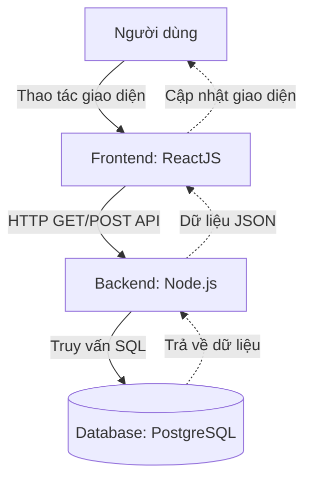
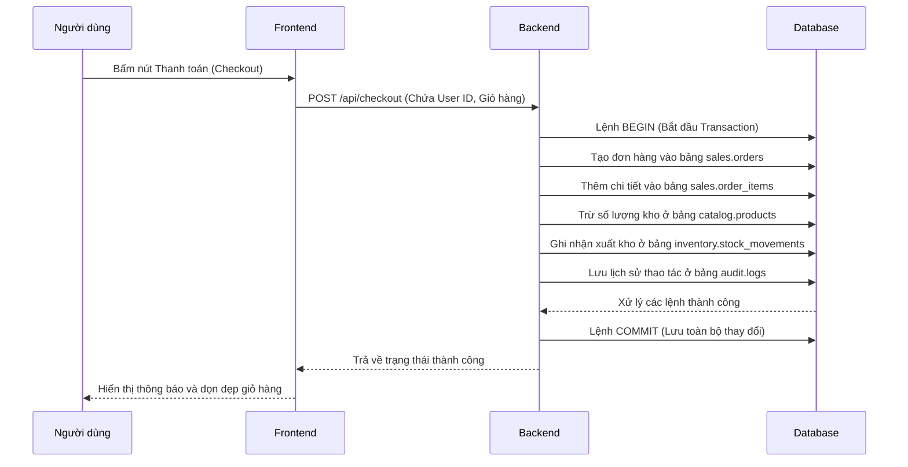

## Tổng quan
Đây là ứng dụng web thương mại điện tử Full-stack. Hệ thống cung cấp các chức năng như đăng nhập, xem danh sách sản phẩm, quản lý giỏ hàng và xem danh sách đơn hàng dành cho quyền Admin.

## Công nghệ sử dụng
- Frontend: ReactJS (Vite)
- Backend: Node.js (ExpressJS)
- Database: PostgreSQL

## Sơ đồ luồng hoạt động

Dưới đây là kiến trúc hệ thống và luồng dữ liệu chung của ứng dụng:

# Demo Database

## Tổng quan
Đây là ứng dụng web thương mại điện tử Full-stack. Hệ thống cung cấp các chức năng như đăng nhập, xem danh sách sản phẩm, quản lý giỏ hàng và xem danh sách đơn hàng dành cho quyền Admin.

## Công nghệ sử dụng
- Frontend: ReactJS (Vite)
- Backend: Node.js (ExpressJS)
- Database: PostgreSQL

## Sơ đồ luồng hoạt động

Dưới đây là kiến trúc hệ thống và luồng dữ liệu chung của ứng dụng:

Chi tiết luồng xử lý chức năng Thanh toán (Checkout) qua Transaction:

## Chức năng chính
- Xác thực người dùng (Đăng nhập)
- Phân quyền người dùng (User / Admin)
- Hiển thị danh sách sản phẩm và trạng thái tồn kho
- Quản lý giỏ hàng
- Thanh toán an toàn sử dụng SQL Transaction
- Bảng điều khiển quản lý đơn hàng cho Admin

## Chức năng chính
- Xác thực người dùng (Đăng nhập)
- Phân quyền người dùng (User / Admin)
- Hiển thị danh sách sản phẩm và trạng thái tồn kho
- Quản lý giỏ hàng
- Thanh toán an toàn sử dụng SQL Transaction
- Bảng điều khiển quản lý đơn hàng cho Admin

