# Syntax mermaid

## 1. Flowchart

### 1.1. Example flowchart: 
---
references:
  - "File: /frontend/src/App.jsx"
generationTime: 2026-09-25T06:41:22.381Z
---
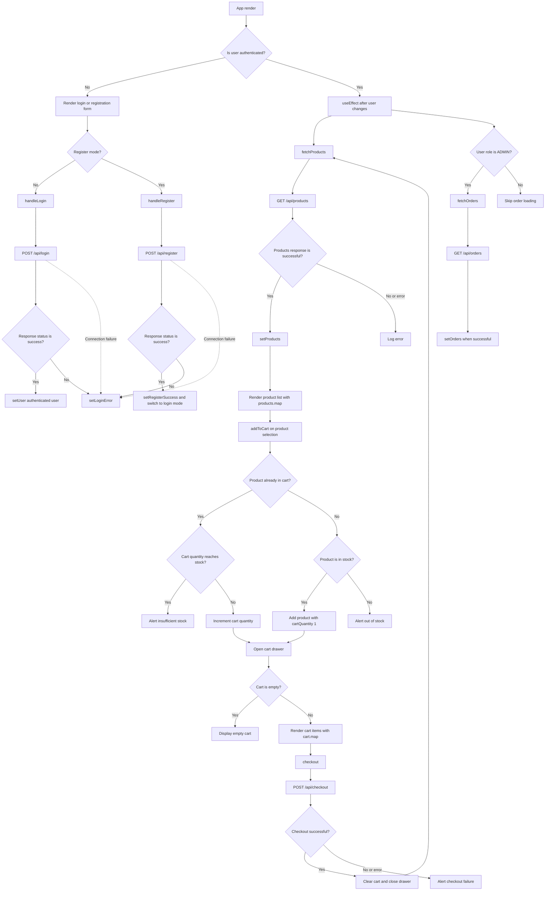

### 1.2. Syntax flowchart: 

 - TD/TB: Top-Down/Top to Down
 - LR: Left to right
 - Bottom to top 
 - RL: Right to left

#### a. Shape
  - Rectangle: 

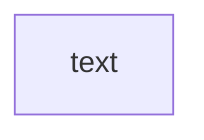
  - Round edges: 

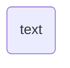

 - A stadium-shaped node:
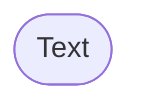

 - Subroutine shape:
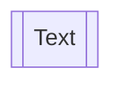

  - Cylindrical shape(Database)
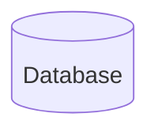

 - Circle: 
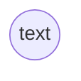
  - asymmetric shape
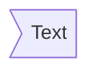

  - Rhombus 
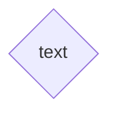

  - Hexagon node:
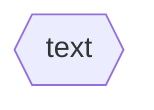
  - Double circle
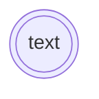

 - A node:

 ```mermaid
 
flowchart LR
  id[text]
 ```

 - Unicode text(use " "):
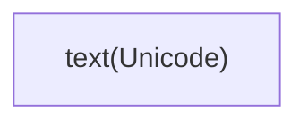

 - Markdown formatting (use "`text`")

 ```mermaid 

flowchart LR
    markdown["`This **is** _Markdown_`"]
    newLines["`Line1
    Line 2
    Line 3`"]
    markdown --> newLines

 ```

#### b. Link between nodes:
- A link with arrow head:


- An open link
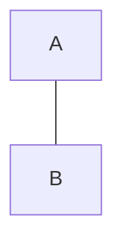
- Text on links
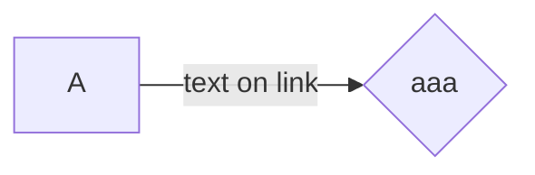

- Dotted link:
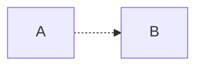

- Thick link:

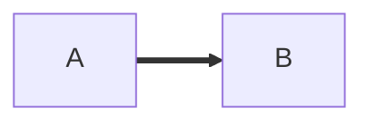

- Chaining of links

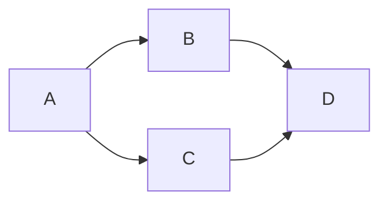

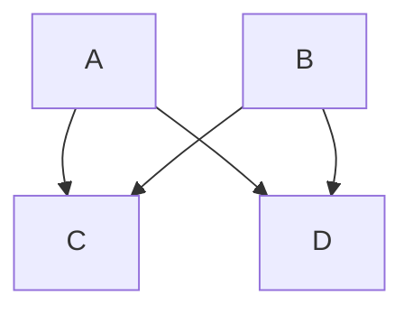

- New arrow types

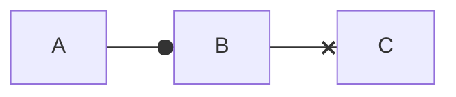
- Multi directional arrows

```mermaid
  flowchart LR
  A o--o B
  B <--> C
  C x--x D
```

#### c. Subgraph

```mermaid 
  flowchart LR 
  c1 --> a2
  
  subgraph one
  a1 --> a2
  end

  subgraph two 
  c1 --> c2
  end
```

- flowchart

```mermaid
  flowchart TD
   c1-->a2
    subgraph one
    a1-->a2
    end
    subgraph two
    b1-->b2
    end
    subgraph three
    c1-->c2
    end
    one --> two
    three --> two
    two --> c2
```

- Direction in subgraph

```mermaid
  flowchart LR
  subgraph TOP
    direction TB
    subgraph B1
        direction RL
        i1 -->f1
    end
    subgraph B2
        direction BT
        i2 -->f2
    end
  end
  A --> TOP --> B
  B1 --> B2
```

#### d. Styling and classes
- Styling a node: 

```mermaid
  flowchart LR
    id1(Start)-->id2(Stop)
    style id1 fill:#f9f,stroke:#333,stroke-width:4px
    style id2 fill:#bbf,stroke:#f66,stroke-width:2px,color:#fff,stroke-dasharray: 5 5
```

```mermaid
flowchart LR
    A:::someclass --> B
    classDef someclass fill:#f96
```

## 2. Achitecture Syntax 
 ### 2.1. Example 

```mermaid
    architecture-beta
    group api(cloud)[API]

    service db(database)[Database] in api
    service disk1(disk)[Storage] in api
    service disk2(disk)[Storage] in api
    service server(server)[Server] in api

    db:L -- R:server
    disk1:T -- B:server
    disk2:T -- B:db

```
### 2.2. Syntax 

#### Building block:  groups, services, edges, junctions

#### Declared: 
- icon: ()
- labels: []

#### a. Groups

##### Syntax:
```bash
  group {group id}({icon name})[{title}] (in {parent id})
```

  - Put together
```bash
  group public_api(cloud)[Public API]
```

  create a group identified á public_api, uses the icon cloud, and has the label Public API

  Additional, group can be placed within a group using the optional <span style="color: red">in </span> keyword 
  ```bash
  group private_api(cloud)[Private API] in public_api
  ```

#### b. Services

##### Syntax:
```bash
service {service id}({icon name})[{title}] (in {parent id})?
```
Put together: 
```bash
service database1(database)[My Database]
```
creates the service identified as <span style="color: red">database1</span>, using the icon <span style="color: red">database</span>, with the label <span style="color: red">My Database</span>.

If the service belongs to a group, it can be placed inside it through the optional <span style="color: red">in</span> keyword
```bash
service database1(database)[My Database] in private_api
```

#### c. Edges
Syntax:
```bash
{serviceId}{{group}}?:{T|B|L|R} {<}?--{>}? {T|B|L|R}:{serviceId}{{group}}?
```

##### Edge Direction
The side of the service the edge comes out of is specified by adding a colon (<span style="color: red">:</span>) to the side of the service connecting to the arrow and adding <span style="color: red">L|R|T|B</span>

For example:
```bash
db:R -- L:server
```
creates an edge between the services <span style="color: red">db</span> and <span style="color: red">server</span>, with the edge coming out of the right of <span style="color: red">db</span> and the left of <span style="color: red">server</span>.
```bash
db:T -- L:server
```
creates a 90 degree edge between the services <span style="color: red">db</span> and <span style="color: red">server</span>, with the edge coming out of the top of <span style="color: red">db</span> and the left of <span style="color: red">server</span>.

#### d. Arrows
Arrows
Add arrows to an edge using <span style="color: red"><</span> on the left and/or <span style="color: red">></span> on the right.
Example:
```bash
subnet:R --> L:gateway
```
→ Creates an arrow pointing into gateway.

Edges out of Groups
Use the <span style="color: red">{group}</span> modifier after a serviceId to connect edges between groups.
Example:
```bash
service server[Server] in groupOne
service subnet[Subnet] in groupTwo
```
server{group}:B --> T:subnet{group}

→ The edge goes out of groupOne near server and into groupTwo near subnet.

Important:

<span style="color: red">groupId</span> cannot be used directly to define edges.

<span style="color: red">{group}</span> can only be used with services inside a group.

#### e. Aligning sibling

Aligning Siblings
Use align to place multiple services/junctions on the same row or column and prevent overlapping.
```bash
align row {idA} {idB} {idC}
align column {idA} {idB} {idC}
```
At least 2 members are required, and all members must already be declared.
align row → same Y-coordinate.
align column → same X-coordinate.
The order of IDs determines their order along the selected axis.

Choose the axis based on edge direction:

- R --> L → use align column.
- B --> T → use align row.

Three databases all feeding mcp via right-to-left edges → stack them in a column:  
Code:

```bash
architecture-beta
    group api(cloud)[API]
    service db1(database)[DB1] in api
    service db2(database)[DB2] in api
    service db3(database)[DB3] in api
    service mcp(server)[MCP] in api
    db1:R --> L:mcp
    db2:R --> L:mcp
    db3:R --> L:mcp
    align column db1 db2 db3

```
```mermaid
architecture-beta
    group api(cloud)[API]
    service db1(database)[DB1] in api
    service db2(database)[DB2] in api
    service db3(database)[DB3] in api
    service mcp(server)[MCP] in api
    db1:R --> L:mcp
    db2:R --> L:mcp
    db3:R --> L:mcp
    align column db1 db2 db3
```

Three sources all feeding <span style="color: red">proc</span> via top-to-bottom edges → arrange them in a row:

```bash
architecture-beta
    service src1(server)[Source 1]
    service src2(server)[Source 2]
    service src3(server)[Source 3]
    service proc(server)[Processor]
    src1:B --> T:proc
    src2:B --> T:proc
    src3:B --> T:proc
    align row src1 src2 src3
```
```mermaid
architecture-beta
    service src1(server)[Source 1]
    service src2(server)[Source 2]
    service src3(server)[Source 3]
    service proc(server)[Processor]
    src1:B --> T:proc
    src2:B --> T:proc
    src3:B --> T:proc
    align row src1 src2 src3
```

#### Grid layouts(combining row and column)

```bash
architecture-beta
    group sources(cloud)[Sources]
        service src_a(server)[Source A] in sources
        service src_b(server)[Source B] in sources
        service src_c(server)[Source C] in sources

    group storage(database)[Storage]
        service db_one(database)[DB One] in storage
        service db_two(database)[DB Two] in storage
        service db_three(database)[DB Three] in storage

    group output(disk)[Output]
        service brief(disk)[Brief] in output
        service analyst(server)[Analyst] in output
        service delivery(cloud)[Delivery] in output

    src_a:B --> T:db_one
    src_b:B --> T:db_two
    src_c:B --> T:db_three
    db_two:B --> T:brief
    brief:R --> L:analyst
    analyst:R --> L:delivery

    align row src_a src_b src_c
    align row db_one db_two db_three
    align row brief analyst delivery

    align column src_a db_one
    align column src_b db_two brief
    align column src_c db_three

```
```mermaid
architecture-beta
    group sources(cloud)[Sources]
        service src_a(server)[Source A] in sources
        service src_b(server)[Source B] in sources
        service src_c(server)[Source C] in sources

    group storage(database)[Storage]
        service db_one(database)[DB One] in storage
        service db_two(database)[DB Two] in storage
        service db_three(database)[DB Three] in storage

    group output(disk)[Output]
        service brief(disk)[Brief] in output
        service analyst(server)[Analyst] in output
        service delivery(cloud)[Delivery] in output

    src_a:B --> T:db_one
    src_b:B --> T:db_two
    src_c:B --> T:db_three
    db_two:B --> T:brief
    brief:R --> L:analyst
    analyst:R --> L:delivery

    align row src_a src_b src_c
    align row db_one db_two db_three
    align row brief analyst delivery

    align column src_a db_one
    align column src_b db_two brief
    align column src_c db_three

```

#### f. Junctions
Syntax:
```bash
junction {junction id} (in {parent id})?
```
Code: 
```bash
architecture-beta
    service left_disk(disk)[Disk]
    service top_disk(disk)[Disk]
    service bottom_disk(disk)[Disk]
    service top_gateway(internet)[Gateway]
    service bottom_gateway(internet)[Gateway]
    junction junctionCenter
    junction junctionRight

    left_disk:R -- L:junctionCenter
    top_disk:B -- T:junctionCenter
    bottom_disk:T -- B:junctionCenter
    junctionCenter:R -- L:junctionRight
    top_gateway:B -- T:junctionRight
    bottom_gateway:T -- B:junctionRight

```

```mermaid
architecture-beta
    service left_disk(disk)[Disk]
    service top_disk(disk)[Disk]
    service bottom_disk(disk)[Disk]
    service top_gateway(internet)[Gateway]
    service bottom_gateway(internet)[Gateway]
    junction junctionCenter
    junction junctionRight

    left_disk:R -- L:junctionCenter
    top_disk:B -- T:junctionCenter
    bottom_disk:T -- B:junctionCenter
    junctionCenter:R -- L:junctionRight
    top_gateway:B -- T:junctionRight
    bottom_gateway:T -- B:junctionRight

```

#### g. Icons 

```mermaid
architecture-beta
    group api(logos:aws-lambda)[API]

    service db(logos:aws-aurora)[Database] in api
    service disk1(logos:aws-glacier)[Storage] in api
    service disk2(logos:aws-s3)[Storage] in api
    service server(logos:aws-ec2)[Server] in api

    db:L -- R:server
    disk1:T -- B:server
    disk2:T -- B:db

```
## 3. Sequence diagram 

Example:

```bash
sequenceDiagram
    Alice->>John: Hello John, how are you?
    John-->>Alice: Great!
    Alice-)John: See you later!
```

```mermaid
sequenceDiagram
    Alice->>John: Hello John, how are you?
    John-->>Alice: Great!
    Alice-)John: See you later!
```

Example 2: Default theme and look (V12.0.0)

```bash
sequenceDiagram
  autonumber
  actor Customer
  participant Web as Web app
  participant API as API gateway
  participant Bank
  Customer->>Web: Place order
  Web->>API: POST /orders
  activate API
  API->>Bank: Authorise payment
  Bank-->>API: Approved
  API-->>Web: 201 Created
  deactivate API
  Web-->>Customer: Order confirmed
  Note over Customer,Bank: One order, one transaction

```

```mermaid
sequenceDiagram
  autonumber
  actor Customer
  participant Web as Web app
  participant API as API gateway
  participant Bank
  Customer->>Web: Place order
  Web->>API: POST /orders
  activate API
  API->>Bank: Authorise payment
  Bank-->>API: Approved
  API-->>Web: 201 Created
  deactivate API
  Web-->>Customer: Order confirmed
  Note over Customer,Bank: One order, one transaction
```

### 3.1. Syntax

#### a. Participants

```bash
sequenceDiagram
    participant Alice
    participant Bob
    Bob->>Alice: Hi Alice
    Alice->>Bob: Hi Bob
```
```mermaid
sequenceDiagram
    participant Alice
    participant Bob
    Bob->>Alice: Hi Alice
    Alice->>Bob: Hi Bob
```

#### b. Actor
```bash
sequenceDiagram
    actor Alice
    actor Bob
    Alice->>Bob: Hi Bob
    Bob->>Alice: Hi Alice
```
```mermaid
sequenceDiagram
    actor Alice
    actor Bob
    Alice->>Bob: Hi Bob
    Bob->>Alice: Hi Alice
```
#### c. Boundary
```bash
sequenceDiagram
    participant Alice@{ "type" : "boundary" }
    participant Bob
    Alice->>Bob: Request from boundary
    Bob->>Alice: Response to boundary
```
```mermaid
sequenceDiagram
    participant Alice@{ "type" : "boundary" }
    participant Bob
    Alice->>Bob: Request from boundary
    Bob->>Alice: Response to boundary
```
#### d. Control
```bash
sequenceDiagram
    participant Alice@{ "type" : "control" }
    participant Bob
    Alice->>Bob: Control request
    Bob->>Alice: Control response
```
```mermaid
sequenceDiagram
    participant Alice@{ "type" : "control" }
    participant Bob
    Alice->>Bob: Control request
    Bob->>Alice: Control response
```

#### e. Enity
